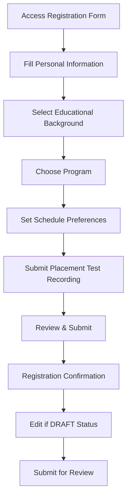
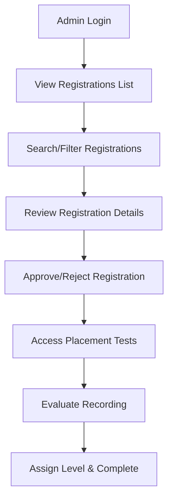

# Student Registration System Documentation

## Overview

The Student Registration System is a comprehensive solution for managing Islamic education enrollment at Yayasan Sahabat Quran. It provides a complete workflow from initial registration through administrative approval and placement test evaluation.

## System Features

### 🎯 Multi-Section Registration Form
- **Personal Information**: Complete biodata with emergency contacts
- **Educational Background**: Academic level and previous Tahsin experience
- **Program Selection**: Database-driven Tahsin/Tahfidz program options
- **Schedule Preferences**: Flexible session selection with day preferences
- **Placement Test**: Quranic recitation recording submission

### 🔄 Registration Workflow
```
DRAFT → SUBMITTED → APPROVED/REJECTED → PLACEMENT_TEST_EVALUATED
```

### 🎓 Program Structure
- **Tahsin Programs**: Level 1-3 for Quranic reading improvement
- **Tahfidz Programs**: Basic to Advanced memorization programs
- **Session Management**: 7 time slots (07:00-17:00) with flexible scheduling

### 🕌 Islamic Context Features
- **Quranic Placement Tests**: Random verse assignment from database
- **Arabic Text Support**: Proper RTL text rendering
- **Islamic Education Terminology**: Tahsin, Tahfidz, Ustadz integration

## Technical Architecture

### Database Schema

#### Core Tables
```sql
-- Programs (6 levels: Tahsin 1-3, Tahfidz Pemula-Lanjutan)
programs (id, name, description, level, category, is_active)

-- Sessions (7 time slots with capacity management)  
sessions (id, name, start_time, end_time, max_capacity, is_active)

-- Placement Test Verses (Quranic verses with difficulty levels)
placement_test_verses (id, surah_name, surah_number, ayah_start, ayah_end, 
                      arabic_text, transliteration, difficulty_level)

-- Student Registrations (main entity with JSONB preferences)
student_registrations (id, full_name, email, phone_number, gender, date_of_birth,
                      education_level, program_id, session_preferences, 
                      registration_status, placement_test_data, created_at, updated_at)
```

#### JSONB Fields
- **session_preferences**: Array of preferred sessions with priorities and days
- **placement_test**: Assigned verse, recording link, evaluation result

### Backend Components

#### Entity Layer (`src/main/java/com/sahabatquran/webapp/entity/`)
- **StudentRegistration.java**: Main registration entity with audit fields
- **Program.java**: Academic program definitions  
- **Session.java**: Time slot management
- **PlacementTestVerse.java**: Quranic verse repository

#### Service Layer (`src/main/java/com/sahabatquran/webapp/service/`)
- **StudentRegistrationService.java**: Core business logic
  - Registration CRUD operations
  - Workflow state management (draft/submit/approve)
  - Placement test assignment and evaluation
  - Email/phone uniqueness validation

#### Controller Layer
- **StudentRegistrationController.java**: Public registration endpoints
- **AdminRegistrationController.java**: Administrative management

### Frontend Templates

#### Registration Flow (`src/main/resources/templates/registration/`)
- **form.html**: 5-section responsive form with progressive enhancement
- **confirmation.html**: Success page with next steps and registration details
- **detail.html**: Registration viewing and editing interface

#### Key Features
- **Progressive Form**: Section-by-section navigation with validation
- **Dynamic Session Management**: Add/remove up to 3 session preferences
- **Responsive Design**: Mobile-first with TailwindCSS
- **Interactive Elements**: Day selection checkboxes, priority dropdowns

## User Workflows

### 1. Student Registration Process



### 2. Admin Management Workflow



## API Endpoints

### Public Endpoints
```
GET  /register                    - Registration form
POST /register                    - Submit registration
GET  /register/{id}              - View registration details
GET  /register/{id}/edit         - Edit registration (DRAFT only)
POST /register/{id}/edit         - Update registration
POST /register/{id}/submit       - Submit for review
```

### Admin Endpoints
```
GET  /admin/registrations                    - List all registrations
GET  /admin/registrations/search            - Search registrations
GET  /admin/registrations/{id}              - Registration details
GET  /admin/registrations/{id}/review       - Review form
POST /admin/registrations/{id}/review       - Submit review
GET  /admin/registrations/placement-tests   - Placement test list
GET  /admin/registrations/{id}/placement-test - Evaluation form
POST /admin/registrations/{id}/placement-test - Submit evaluation
```

## Testing Strategy

### Functional Test Organization ✅

Tests are organized by business process with selective execution patterns:

#### Test Classes
```
StudentRegistrationHappyPathTest     - Complete registration workflow
StudentRegistrationValidationTest    - Form validation & duplicates
AdminRegistrationHappyPathTest      - Admin review & approval workflow  
AdminRegistrationValidationTest     - Access control & form validation
PlacementTestHappyPathTest         - Placement test evaluation
PlacementTestValidationTest        - Evaluation rules & validation
```

#### Selective Execution Examples
```bash
# Business process tests
./mvnw test -Dtest="*StudentRegistration*"
./mvnw test -Dtest="*AdminRegistration*"
./mvnw test -Dtest="*PlacementTest*"

# Test type execution
./mvnw test -Dtest="*HappyPath*"
./mvnw test -Dtest="*Validation*"

# Specific combinations
./mvnw test -Dtest="*AdminRegistration*HappyPath*"
```

### Test Coverage
- **Happy Path**: Complete workflows with successful outcomes
- **Validation**: Form validation, business rules, duplicate prevention
- **Access Control**: Authorization, role-based restrictions
- **Edge Cases**: Missing data, invalid states, error handling

## Security Features

### Access Control
- **Public Access**: Registration form and confirmation pages
- **Admin Only**: Registration management, placement test evaluation
- **Permission-Based**: Fine-grained control with Spring Security

### Data Protection
- **Input Validation**: Server-side validation for all form fields
- **XSS Protection**: Thymeleaf auto-escaping, CSP headers
- **CSRF Protection**: Spring Security CSRF tokens
- **SQL Injection**: JPA/Hibernate parameterized queries

## Performance Considerations

### Database Optimizations
- **Indexes**: Strategic indexes on search fields (email, phone, name)
- **JSONB**: Efficient storage for flexible session preferences
- **Pagination**: Large result set handling in admin interfaces
- **Connection Pooling**: HikariCP for database connections

### Frontend Performance
- **Progressive Enhancement**: JavaScript enhancements over solid HTML
- **Lazy Loading**: Session data loaded on-demand
- **Caching**: Static assets and reference data caching
- **Responsive Images**: Optimized logo and media assets

## Configuration

### Application Properties
```properties
# Registration specific settings
app.registration.max-session-preferences=3
app.registration.placement-test.enabled=true
app.registration.auto-assign-verse=true

# Email settings for notifications
spring.mail.host=smtp.gmail.com
spring.mail.username=${MAIL_USERNAME}
spring.mail.password=${MAIL_PASSWORD}
```

### Environment Variables
```bash
# Database connection
DB_HOST=localhost
DB_NAME=sahabat_quran
DB_USERNAME=postgres
DB_PASSWORD=password

# Email configuration
MAIL_USERNAME=admin@sahabatquran.com
MAIL_PASSWORD=secure_password
```

## Maintenance & Monitoring

### Health Checks
- **Database Connectivity**: Automatic health monitoring
- **Email Service**: SMTP connection validation
- **File Upload**: Drive link validation for recordings

### Logging
```java
// Service layer logging
log.info("Registration created: {}", registration.getId());
log.warn("Duplicate email attempt: {}", email);
log.error("Placement test assignment failed", exception);
```

### Metrics
- Registration completion rates
- Admin processing times  
- Placement test evaluation metrics
- System performance indicators

## Future Enhancements

### Phase 2 Features
- [ ] Email notifications for workflow stages
- [ ] SMS integration for important updates
- [ ] Parent portal integration
- [ ] Mobile app API endpoints
- [ ] Advanced reporting dashboards
- [ ] Integration with payment system
- [ ] Class assignment automation
- [ ] Student portal development

### Technical Improvements
- [ ] GraphQL API for mobile apps
- [ ] Real-time notifications with WebSocket
- [ ] Advanced search with Elasticsearch
- [ ] File storage with cloud providers
- [ ] Performance monitoring with APM tools