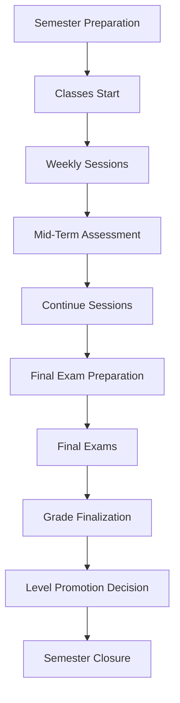

# Semester Activities Recording Plan

## Executive Summary

This document outlines the comprehensive plan for recording and managing all class activities throughout an entire semester at Yayasan Sahabat Quran. The semester lifecycle spans from class preparation through final grade determination and student level promotion, ending with formal semester closure by academic staff.

## Semester Lifecycle Overview



---

## Phase 1: Active Semester Operations (Weeks 1-14)

### 1.1 Session Execution & Recording

#### **Daily Class Session Activities**

**Before Session:**
- Teacher self-check-in via mobile/web interface
- Session preparation status verification
- Material availability confirmation
- Substitute arrangement if needed

**During Session:**
- Real-time attendance marking for students
- Session content delivery tracking
- Learning objective achievement recording
- Special incidents/observations logging

**After Session:**
- Teacher check-out recording
- Session summary submission
- Homework assignment creation
- Parent communication notes

#### **Required Data Capture:**

```sql
-- Revised class_sessions table definition (replace existing)
CREATE TABLE class_sessions (
    id UUID PRIMARY KEY DEFAULT gen_random_uuid(),
    id_class_group UUID NOT NULL REFERENCES class_groups(id),
    session_date DATE NOT NULL,
    session_number INTEGER,
    
    -- Session execution tracking
    session_status VARCHAR(20) DEFAULT 'SCHEDULED',
    -- SCHEDULED, IN_PROGRESS, COMPLETED, CANCELLED, POSTPONED, RESCHEDULED
    actual_start_time TIMESTAMP,
    actual_end_time TIMESTAMP,
    
    -- Academic content
    learning_objectives TEXT[],
    teaching_materials JSONB,
    session_summary TEXT,
    objectives_achieved JSONB,
    homework_assigned JSONB,
    special_incidents JSONB,
    
    -- Instructor management
    id_instructor UUID NOT NULL REFERENCES users(id), -- Current assigned instructor
    original_instructor UUID REFERENCES users(id),     -- Original scheduled instructor
    substitute_instructor UUID REFERENCES users(id),   -- Substitute if different from assigned
    
    -- Rescheduling management
    original_session_date DATE,    -- Original date if rescheduled
    reschedule_reason VARCHAR(200),
    rescheduled_by UUID REFERENCES users(id),
    rescheduled_at TIMESTAMP,
    
    -- Preparation tracking
    preparation_status VARCHAR(20) DEFAULT 'DRAFT',
    -- DRAFT, IN_PROGRESS, READY, COMPLETED
    
    -- Audit fields
    created_at TIMESTAMP DEFAULT CURRENT_TIMESTAMP,
    updated_at TIMESTAMP DEFAULT CURRENT_TIMESTAMP,
    
    UNIQUE(id_class_group, session_date)
);
```

### 1.2 Session Rescheduling & Teacher Replacement Management

#### **Session Rescheduling System**

```sql
-- Session rescheduling history and reasons
CREATE TABLE session_reschedule_log (
    id UUID PRIMARY KEY DEFAULT gen_random_uuid(),
    id_class_session UUID NOT NULL REFERENCES class_sessions(id),
    reschedule_type VARCHAR(30) NOT NULL, 
    -- TEACHER_ILLNESS, TEACHER_EMERGENCY, NATIONAL_HOLIDAY, NATURAL_DISASTER, 
    -- SECURITY_ISSUE, FACILITY_UNAVAILABLE, ADMINISTRATIVE
    reason_category VARCHAR(50) NOT NULL,
    detailed_reason TEXT,
    
    -- Original schedule
    original_date DATE NOT NULL,
    original_time TIME,
    
    -- New schedule  
    new_date DATE,
    new_time TIME,
    
    -- Impact assessment
    affected_students_count INTEGER,
    makeup_session_required BOOLEAN DEFAULT false,
    parent_notification_sent BOOLEAN DEFAULT false,
    parent_notification_date TIMESTAMP,
    
    -- Approval workflow
    requested_by UUID REFERENCES users(id),
    requested_at TIMESTAMP DEFAULT CURRENT_TIMESTAMP,
    approved_by UUID REFERENCES users(id),
    approved_at TIMESTAMP,
    status VARCHAR(20) DEFAULT 'PENDING', -- PENDING, APPROVED, REJECTED, IMPLEMENTED
    
    created_at TIMESTAMP DEFAULT CURRENT_TIMESTAMP
);

-- Reschedule reason templates for common scenarios
CREATE TABLE reschedule_reason_templates (
    id UUID PRIMARY KEY DEFAULT gen_random_uuid(),
    reason_code VARCHAR(50) UNIQUE NOT NULL,
    display_name VARCHAR(100) NOT NULL,
    default_message TEXT,
    requires_approval BOOLEAN DEFAULT true,
    max_reschedule_days INTEGER DEFAULT 14,
    auto_notify_parents BOOLEAN DEFAULT true,
    category VARCHAR(30) NOT NULL,
    is_active BOOLEAN DEFAULT true,
    created_at TIMESTAMP DEFAULT CURRENT_TIMESTAMP
);

-- Default reschedule reasons
INSERT INTO reschedule_reason_templates (reason_code, display_name, default_message, category, requires_approval, max_reschedule_days) VALUES
('TEACHER_SICK', 'Teacher Illness', 'Kelas ditunda karena ustadz/ustadzah berhalangan hadir karena sakit', 'TEACHER_ILLNESS', false, 7),
('TEACHER_EMERGENCY', 'Teacher Emergency', 'Kelas ditunda karena ustadz/ustadzah ada keperluan mendesak', 'TEACHER_EMERGENCY', true, 3),
('NATIONAL_HOLIDAY', 'National Holiday', 'Kelas ditunda karena hari libur nasional', 'NATIONAL_HOLIDAY', false, 30),
('NATURAL_DISASTER', 'Natural Disaster', 'Kelas ditunda karena bencana alam/cuaca buruk', 'NATURAL_DISASTER', true, 14),
('SECURITY_ISSUE', 'Security Issue', 'Kelas ditunda karena alasan keamanan', 'SECURITY_ISSUE', true, 7),
('FACILITY_ISSUE', 'Facility Unavailable', 'Kelas ditunda karena ruangan/fasilitas tidak tersedia', 'FACILITY_UNAVAILABLE', true, 7);
```

#### **Hybrid Teacher Replacement System**

##### **A. Session-Level & Semester-Level Teacher Pool**

```sql
-- Enhanced teacher pool supporting both short-term and long-term assignments
CREATE TABLE teacher_replacement_pool (
    id UUID PRIMARY KEY DEFAULT gen_random_uuid(),
    id_teacher UUID NOT NULL REFERENCES users(id),
    
    -- Teaching qualifications
    id_level UUID REFERENCES levels(id), -- Can teach this level
    specialization VARCHAR(100), -- 'Tahsin', 'Tahfidz', 'Beginner', etc.
    teaching_experience_years INTEGER DEFAULT 0,
    certifications JSONB, -- Teaching certificates, qualifications
    
    -- Availability for short-term (session-level) assignments
    short_term_available BOOLEAN DEFAULT true,
    availability_days INTEGER[], -- [1,2,3,4,5,6,7] for Mon-Sun
    availability_times VARCHAR(100)[], -- ['PAGI', 'SIANG', 'SORE', 'MALAM']
    max_substitute_hours_per_week INTEGER DEFAULT 10,
    hourly_rate DECIMAL(10,2),
    emergency_available BOOLEAN DEFAULT false, -- Available for emergency calls
    
    -- Availability for long-term (semester-level) assignments
    long_term_available BOOLEAN DEFAULT false,
    max_concurrent_classes INTEGER DEFAULT 3,
    willing_full_semester BOOLEAN DEFAULT false,
    monthly_salary_expectation DECIMAL(12,2),
    notice_period_days INTEGER DEFAULT 7, -- How much notice needed
    contract_type_preference VARCHAR(30), -- TEMPORARY, PERMANENT, FLEXIBLE
    
    -- Contact and logistics
    emergency_contact VARCHAR(20),
    preferred_locations JSONB, -- Which campuses/locations they prefer
    transportation_available BOOLEAN DEFAULT true,
    
    -- Performance tracking
    is_available BOOLEAN DEFAULT true,
    last_short_assignment_date DATE,
    last_long_assignment_date DATE,
    total_substitute_hours INTEGER DEFAULT 0,
    total_semester_assignments INTEGER DEFAULT 0,
    short_term_rating DECIMAL(3,2) DEFAULT 5.0,
    long_term_rating DECIMAL(3,2) DEFAULT 5.0,
    reliability_score DECIMAL(3,2) DEFAULT 5.0,
    
    -- Administrative
    background_check_status VARCHAR(20) DEFAULT 'PENDING', -- PENDING, APPROVED, REJECTED
    background_check_date DATE,
    contract_status VARCHAR(20) DEFAULT 'ACTIVE', -- ACTIVE, INACTIVE, SUSPENDED
    
    created_at TIMESTAMP DEFAULT CURRENT_TIMESTAMP,
    updated_at TIMESTAMP DEFAULT CURRENT_TIMESTAMP
);

##### **B. Long-Term Teacher Assignments (Semester-Level)**

```sql
-- Long-term teacher replacement assignments
CREATE TABLE long_term_teacher_assignments (
    id UUID PRIMARY KEY DEFAULT gen_random_uuid(),
    id_class_group UUID NOT NULL REFERENCES class_groups(id),
    id_original_teacher UUID NOT NULL REFERENCES users(id),
    id_replacement_teacher UUID NOT NULL REFERENCES users(id),
    
    -- Assignment details
    replacement_type VARCHAR(30) NOT NULL, -- TEMPORARY, PERMANENT, SEMESTER_LONG, MATERNITY_LEAVE
    assignment_reason VARCHAR(200) NOT NULL,
    effective_start_date DATE NOT NULL,
    effective_end_date DATE, -- NULL for permanent replacements
    
    -- Contract and compensation
    salary_arrangement VARCHAR(30), -- HOURLY, MONTHLY, FULL_SALARY_TRANSFER
    compensation_amount DECIMAL(12,2),
    benefits_included BOOLEAN DEFAULT false,
    contract_signed BOOLEAN DEFAULT false,
    contract_document_path VARCHAR(255),
    
    -- Handover management
    handover_scheduled_date DATE,
    handover_completed_date DATE,
    curriculum_materials_transferred BOOLEAN DEFAULT false,
    student_records_transferred BOOLEAN DEFAULT false,
    class_management_notes_provided BOOLEAN DEFAULT false,
    parent_introduction_completed BOOLEAN DEFAULT false,
    
    -- Stakeholder notifications
    students_notified BOOLEAN DEFAULT false,
    students_notification_date DATE,
    parents_notified BOOLEAN DEFAULT false,
    parents_notification_date DATE,
    admin_staff_notified BOOLEAN DEFAULT false,
    
    -- Class continuity planning
    curriculum_continuity_plan TEXT,
    assessment_schedule_maintained BOOLEAN DEFAULT true,
    special_student_needs_documented BOOLEAN DEFAULT false,
    class_performance_baseline JSONB, -- Performance before replacement
    
    -- Performance monitoring during assignment
    weekly_check_ins_scheduled BOOLEAN DEFAULT true,
    student_adjustment_issues INTEGER DEFAULT 0,
    parent_complaint_count INTEGER DEFAULT 0,
    academic_performance_maintained BOOLEAN DEFAULT true,
    
    -- Assignment outcome
    assignment_status VARCHAR(20) DEFAULT 'ACTIVE', -- ACTIVE, COMPLETED, TERMINATED, EXTENDED
    completion_reason VARCHAR(200),
    original_teacher_return_date DATE,
    assignment_success_rating DECIMAL(3,2),
    
    -- Administrative workflow
    requested_by UUID REFERENCES users(id),
    approved_by UUID REFERENCES users(id),
    requested_at TIMESTAMP DEFAULT CURRENT_TIMESTAMP,
    approved_at TIMESTAMP,
    
    created_at TIMESTAMP DEFAULT CURRENT_TIMESTAMP,
    updated_at TIMESTAMP DEFAULT CURRENT_TIMESTAMP,
    
    UNIQUE(id_class_group, effective_start_date)
);

-- Handover checklist and documentation
CREATE TABLE teacher_handover_checklist (
    id UUID PRIMARY KEY DEFAULT gen_random_uuid(),
    id_long_term_assignment UUID NOT NULL REFERENCES long_term_teacher_assignments(id),
    
    -- Documentation handover
    lesson_plans_transferred BOOLEAN DEFAULT false,
    student_assessment_records BOOLEAN DEFAULT false,
    attendance_records BOOLEAN DEFAULT false,
    parent_communication_history BOOLEAN DEFAULT false,
    class_behavioral_notes BOOLEAN DEFAULT false,
    curriculum_progress_tracking BOOLEAN DEFAULT false,
    
    -- Physical materials
    textbooks_handed_over BOOLEAN DEFAULT false,
    teaching_aids_transferred BOOLEAN DEFAULT false,
    classroom_keys_provided BOOLEAN DEFAULT false,
    technology_access_granted BOOLEAN DEFAULT false,
    
    -- Administrative access
    system_login_credentials BOOLEAN DEFAULT false,
    class_management_portal_access BOOLEAN DEFAULT false,
    parent_communication_platform BOOLEAN DEFAULT false,
    
    -- Knowledge transfer sessions
    curriculum_overview_session BOOLEAN DEFAULT false,
    student_individual_needs_briefing BOOLEAN DEFAULT false,
    class_dynamics_discussion BOOLEAN DEFAULT false,
    parent_relationships_briefing BOOLEAN DEFAULT false,
    school_policies_orientation BOOLEAN DEFAULT false,
    
    -- Transition planning
    student_introduction_plan BOOLEAN DEFAULT false,
    first_week_schedule_planned BOOLEAN DEFAULT false,
    emergency_procedures_explained BOOLEAN DEFAULT false,
    support_contact_persons_identified BOOLEAN DEFAULT false,
    
    -- Completion tracking
    handover_completed BOOLEAN DEFAULT false,
    completed_by UUID REFERENCES users(id),
    completed_at TIMESTAMP,
    
    -- Quality assurance
    original_teacher_sign_off BOOLEAN DEFAULT false,
    replacement_teacher_confirmation BOOLEAN DEFAULT false,
    admin_verification BOOLEAN DEFAULT false,
    
    created_at TIMESTAMP DEFAULT CURRENT_TIMESTAMP
);
```

##### **C. Session-Level Substitute Assignments (Short-Term)**

```sql
-- Short-term substitute assignments tracking
CREATE TABLE substitute_assignments (
    id UUID PRIMARY KEY DEFAULT gen_random_uuid(),
    id_class_session UUID NOT NULL REFERENCES class_sessions(id),
    id_original_teacher UUID NOT NULL REFERENCES users(id),
    id_substitute_teacher UUID NOT NULL REFERENCES users(id),
    
    -- Assignment details
    assignment_type VARCHAR(30) NOT NULL, -- PLANNED, EMERGENCY, LAST_MINUTE
    reason_for_substitution VARCHAR(200),
    notice_period_hours INTEGER, -- How much advance notice given
    
    -- Preparation handover
    materials_provided BOOLEAN DEFAULT false,
    lesson_plan_shared BOOLEAN DEFAULT false,
    student_info_shared BOOLEAN DEFAULT false,
    special_instructions TEXT,
    
    -- Execution tracking
    substitute_arrived BOOLEAN DEFAULT false,
    substitute_arrival_time TIMESTAMP,
    session_conducted BOOLEAN DEFAULT false,
    session_quality_rating DECIMAL(3,2),
    substitute_notes TEXT,
    student_feedback_summary TEXT,
    
    -- Financial tracking
    substitute_fee DECIMAL(10,2),
    payment_status VARCHAR(20) DEFAULT 'PENDING',
    
    -- Follow-up
    original_teacher_briefed BOOLEAN DEFAULT false,
    follow_up_required BOOLEAN DEFAULT false,
    follow_up_notes TEXT,
    
    -- Workflow
    assigned_by UUID REFERENCES users(id),
    assigned_at TIMESTAMP DEFAULT CURRENT_TIMESTAMP,
    confirmed_by_substitute BOOLEAN DEFAULT false,
    confirmed_at TIMESTAMP,
    
    created_at TIMESTAMP DEFAULT CURRENT_TIMESTAMP
);

-- Substitute teacher performance tracking
CREATE TABLE substitute_performance_log (
    id UUID PRIMARY KEY DEFAULT gen_random_uuid(),
    id_substitute_assignment UUID NOT NULL REFERENCES substitute_assignments(id),
    id_substitute_teacher UUID NOT NULL REFERENCES users(id),
    
    -- Performance metrics
    punctuality_score DECIMAL(3,2) DEFAULT 5.0, -- 1-5 scale
    teaching_quality_score DECIMAL(3,2) DEFAULT 5.0,
    student_engagement_score DECIMAL(3,2) DEFAULT 5.0,
    material_preparation_score DECIMAL(3,2) DEFAULT 5.0,
    communication_score DECIMAL(3,2) DEFAULT 5.0,
    overall_score DECIMAL(3,2) DEFAULT 5.0,
    
    -- Feedback
    admin_feedback TEXT,
    student_feedback TEXT,
    parent_feedback TEXT,
    original_teacher_feedback TEXT,
    
    -- Future availability impact
    recommend_for_future BOOLEAN DEFAULT true,
    blacklist_reason TEXT,
    
    evaluated_by UUID REFERENCES users(id),
    evaluated_at TIMESTAMP DEFAULT CURRENT_TIMESTAMP,
    created_at TIMESTAMP DEFAULT CURRENT_TIMESTAMP
);
```

### 1.3 Anonymous Student Feedback System

#### **Comprehensive Student Voice Collection**

```sql
-- Student feedback configuration and questions
CREATE TABLE student_feedback_templates (
    id UUID PRIMARY KEY DEFAULT gen_random_uuid(),
    template_name VARCHAR(100) NOT NULL,
    template_category VARCHAR(50) NOT NULL, 
    -- TEACHER_EVALUATION, FACILITY_ASSESSMENT, CURRICULUM_FEEDBACK, CLASS_ENVIRONMENT, OVERALL_EXPERIENCE
    template_type VARCHAR(30) NOT NULL, -- WEEKLY, MONTHLY, MIDTERM, FINAL, EVENT_BASED
    
    -- Template settings
    is_anonymous BOOLEAN DEFAULT true,
    is_active BOOLEAN DEFAULT true,
    target_audience VARCHAR(30), -- ALL_STUDENTS, LEVEL_SPECIFIC, CLASS_SPECIFIC
    minimum_responses INTEGER DEFAULT 5,
    response_deadline_days INTEGER DEFAULT 7,
    
    -- Scheduling
    auto_schedule BOOLEAN DEFAULT false,
    schedule_week INTEGER, -- Week number for auto-scheduling
    custom_schedule_date DATE,
    
    created_at TIMESTAMP DEFAULT CURRENT_TIMESTAMP,
    created_by UUID REFERENCES users(id),
    updated_at TIMESTAMP DEFAULT CURRENT_TIMESTAMP
);

-- Individual feedback questions within templates
CREATE TABLE feedback_questions (
    id UUID PRIMARY KEY DEFAULT gen_random_uuid(),
    id_template UUID NOT NULL REFERENCES student_feedback_templates(id),
    question_order INTEGER NOT NULL,
    question_category VARCHAR(50) NOT NULL,
    -- TEACHING_QUALITY, COMMUNICATION, PUNCTUALITY, FAIRNESS, CLASSROOM_MANAGEMENT, FACILITY_CONDITION, SAFETY, LEARNING_RESOURCES
    
    -- Question content
    question_text TEXT NOT NULL,
    question_text_english TEXT, -- Optional English translation
    question_type VARCHAR(30) NOT NULL, -- RATING_5_SCALE, RATING_10_SCALE, YES_NO, MULTIPLE_CHOICE, TEXT_SHORT, TEXT_LONG
    
    -- Answer options for choice questions
    answer_options JSONB, -- ["Sangat Baik", "Baik", "Cukup", "Kurang", "Sangat Kurang"]
    answer_options_english JSONB, -- Optional English options
    
    -- Question settings
    is_required BOOLEAN DEFAULT true,
    allow_not_applicable BOOLEAN DEFAULT false,
    
    created_at TIMESTAMP DEFAULT CURRENT_TIMESTAMP
);

-- Student feedback campaigns/surveys
CREATE TABLE student_feedback_campaigns (
    id UUID PRIMARY KEY DEFAULT gen_random_uuid(),
    id_template UUID NOT NULL REFERENCES student_feedback_templates(id),
    campaign_name VARCHAR(100) NOT NULL,
    
    -- Campaign scope
    target_type VARCHAR(30) NOT NULL, -- ALL_STUDENTS, SPECIFIC_LEVEL, SPECIFIC_CLASS, SPECIFIC_INSTRUCTOR
    target_level_id UUID REFERENCES levels(id),
    target_class_id UUID REFERENCES class_groups(id),
    target_instructor_id UUID REFERENCES users(id),
    
    -- Campaign timing
    start_date DATE NOT NULL,
    end_date DATE NOT NULL,
    reminder_frequency_days INTEGER DEFAULT 2,
    
    -- Privacy and security
    anonymity_level VARCHAR(20) DEFAULT 'FULL', -- FULL, PARTIAL, IDENTIFIED
    ip_tracking_enabled BOOLEAN DEFAULT false,
    require_enrollment_verification BOOLEAN DEFAULT true,
    
    -- Campaign status
    status VARCHAR(20) DEFAULT 'DRAFT', -- DRAFT, ACTIVE, COMPLETED, CANCELLED
    total_target_students INTEGER,
    total_responses INTEGER DEFAULT 0,
    response_rate DECIMAL(5,2) DEFAULT 0.0,
    
    -- Results and reporting
    results_published BOOLEAN DEFAULT false,
    summary_report_generated BOOLEAN DEFAULT false,
    stakeholders_notified BOOLEAN DEFAULT false,
    
    created_at TIMESTAMP DEFAULT CURRENT_TIMESTAMP,
    created_by UUID REFERENCES users(id),
    launched_at TIMESTAMP,
    completed_at TIMESTAMP
);

-- Individual student feedback responses
CREATE TABLE student_feedback_responses (
    id UUID PRIMARY KEY DEFAULT gen_random_uuid(),
    id_campaign UUID NOT NULL REFERENCES student_feedback_campaigns(id),
    
    -- Anonymous student identification
    anonymous_student_token UUID NOT NULL, -- Generated unique token per student per campaign
    student_level_id UUID REFERENCES levels(id), -- For analysis but not identification
    student_class_id UUID REFERENCES class_groups(id), -- For analysis
    
    -- Response metadata
    submitted_at TIMESTAMP DEFAULT CURRENT_TIMESTAMP,
    completion_time_minutes INTEGER, -- Time taken to complete
    submission_ip_hash VARCHAR(64), -- Hashed IP for abuse prevention
    user_agent_hash VARCHAR(64), -- Hashed user agent
    
    -- Response validation
    response_validity VARCHAR(20) DEFAULT 'VALID', -- VALID, DUPLICATE, SUSPICIOUS, INVALID
    validation_notes TEXT,
    
    -- Quality indicators
    all_questions_answered BOOLEAN DEFAULT false,
    has_constructive_comments BOOLEAN DEFAULT false,
    response_consistency_score DECIMAL(3,2), -- 1-5, consistency across similar questions
    
    created_at TIMESTAMP DEFAULT CURRENT_TIMESTAMP
);

-- Individual answers to specific questions
CREATE TABLE student_feedback_answers (
    id UUID PRIMARY KEY DEFAULT gen_random_uuid(),
    id_response UUID NOT NULL REFERENCES student_feedback_responses(id),
    id_question UUID NOT NULL REFERENCES feedback_questions(id),
    
    -- Answer content
    rating_value INTEGER, -- For rating questions (1-5 or 1-10)
    choice_value VARCHAR(100), -- For multiple choice
    text_value TEXT, -- For text questions
    boolean_value BOOLEAN, -- For yes/no questions
    
    -- Answer metadata
    confidence_level INTEGER, -- 1-5, how confident student is in their answer
    skipped BOOLEAN DEFAULT false,
    not_applicable BOOLEAN DEFAULT false,
    
    answered_at TIMESTAMP DEFAULT CURRENT_TIMESTAMP
);
```

#### **Feedback Categories and Templates**

##### **1. Teacher Evaluation Template**
```sql
-- Pre-built teacher evaluation questions
INSERT INTO feedback_questions (id_template, question_order, question_category, question_text, question_type, answer_options) VALUES
-- Teaching Quality
(uuid_generate_v4(), 1, 'TEACHING_QUALITY', 'Bagaimana kualitas pengajaran ustadz/ustadzah?', 'RATING_5_SCALE', '["Sangat Baik", "Baik", "Cukup", "Kurang", "Sangat Kurang"]'),
(uuid_generate_v4(), 2, 'TEACHING_QUALITY', 'Apakah materi pelajaran disampaikan dengan jelas?', 'RATING_5_SCALE', '["Sangat Jelas", "Jelas", "Cukup Jelas", "Kurang Jelas", "Tidak Jelas"]'),
(uuid_generate_v4(), 3, 'TEACHING_QUALITY', 'Apakah ustadz/ustadzah memberikan contoh yang mudah dipahami?', 'YES_NO', null),

-- Communication & Interaction
(uuid_generate_v4(), 4, 'COMMUNICATION', 'Bagaimana kemampuan ustadz/ustadzah dalam menjawab pertanyaan?', 'RATING_5_SCALE', '["Sangat Baik", "Baik", "Cukup", "Kurang", "Sangat Kurang"]'),
(uuid_generate_v4(), 5, 'COMMUNICATION', 'Apakah ustadz/ustadzah bersikap sabar dan ramah?', 'RATING_5_SCALE', '["Sangat Sabar", "Sabar", "Cukup", "Kurang Sabar", "Tidak Sabar"]'),
(uuid_generate_v4(), 6, 'COMMUNICATION', 'Seberapa mudah berkomunikasi dengan ustadz/ustadzah?', 'RATING_5_SCALE', '["Sangat Mudah", "Mudah", "Cukup", "Sulit", "Sangat Sulit"]'),

-- Punctuality & Reliability
(uuid_generate_v4(), 7, 'PUNCTUALITY', 'Apakah ustadz/ustadzah selalu hadir tepat waktu?', 'RATING_5_SCALE', '["Selalu", "Sering", "Kadang-kadang", "Jarang", "Tidak Pernah"]'),
(uuid_generate_v4(), 8, 'PUNCTUALITY', 'Apakah ustadz/ustadzah siap dengan materi setiap pertemuan?', 'RATING_5_SCALE', '["Selalu Siap", "Sering Siap", "Kadang Siap", "Jarang Siap", "Tidak Siap"]'),

-- Fairness & Classroom Management
(uuid_generate_v4(), 9, 'FAIRNESS', 'Apakah ustadz/ustadzah berlaku adil kepada semua siswa?', 'RATING_5_SCALE', '["Sangat Adil", "Adil", "Cukup Adil", "Kurang Adil", "Tidak Adil"]'),
(uuid_generate_v4(), 10, 'CLASSROOM_MANAGEMENT', 'Bagaimana suasana kelas yang diciptakan?', 'RATING_5_SCALE', '["Sangat Kondusif", "Kondusif", "Cukup", "Kurang Kondusif", "Tidak Kondusif"]'),

-- Open-ended feedback
(uuid_generate_v4(), 11, 'GENERAL', 'Apa yang paling Anda sukai dari cara mengajar ustadz/ustadzah?', 'TEXT_SHORT', null),
(uuid_generate_v4(), 12, 'GENERAL', 'Apa saran Anda untuk meningkatkan kualitas pengajaran?', 'TEXT_SHORT', null);
```

##### **2. Facility Assessment Template**
```sql
-- Facility and environment evaluation
INSERT INTO feedback_questions (id_template, question_order, question_category, question_text, question_type, answer_options) VALUES
-- Physical Environment
(uuid_generate_v4(), 1, 'FACILITY_CONDITION', 'Bagaimana kondisi ruang kelas?', 'RATING_5_SCALE', '["Sangat Baik", "Baik", "Cukup", "Kurang", "Buruk"]'),
(uuid_generate_v4(), 2, 'FACILITY_CONDITION', 'Apakah pencahayaan ruang kelas memadai?', 'RATING_5_SCALE', '["Sangat Baik", "Baik", "Cukup", "Kurang", "Sangat Kurang"]'),
(uuid_generate_v4(), 3, 'FACILITY_CONDITION', 'Bagaimana kondisi kebersihan ruang kelas?', 'RATING_5_SCALE', '["Sangat Bersih", "Bersih", "Cukup", "Kurang Bersih", "Kotor"]'),
(uuid_generate_v4(), 4, 'FACILITY_CONDITION', 'Apakah suhu ruangan nyaman untuk belajar?', 'RATING_5_SCALE', '["Sangat Nyaman", "Nyaman", "Cukup", "Kurang Nyaman", "Tidak Nyaman"]'),

-- Learning Resources
(uuid_generate_v4(), 5, 'LEARNING_RESOURCES', 'Bagaimana kualitas papan tulis/whiteboard?', 'RATING_5_SCALE', '["Sangat Baik", "Baik", "Cukup", "Kurang", "Buruk"]'),
(uuid_generate_v4(), 6, 'LEARNING_RESOURCES', 'Apakah Al-Quran dan buku pelajaran tersedia dengan baik?', 'RATING_5_SCALE', '["Sangat Baik", "Baik", "Cukup", "Kurang", "Tidak Ada"]'),
(uuid_generate_v4(), 7, 'LEARNING_RESOURCES', 'Bagaimana kondisi meja dan kursi?', 'RATING_5_SCALE', '["Sangat Baik", "Baik", "Cukup", "Kurang", "Buruk"]'),

-- Safety and Accessibility
(uuid_generate_v4(), 8, 'SAFETY', 'Apakah Anda merasa aman di lingkungan sekolah?', 'RATING_5_SCALE', '["Sangat Aman", "Aman", "Cukup", "Kurang Aman", "Tidak Aman"]'),
(uuid_generate_v4(), 9, 'SAFETY', 'Bagaimana kondisi toilet/kamar mandi?', 'RATING_5_SCALE', '["Sangat Baik", "Baik", "Cukup", "Kurang", "Buruk"]'),
(uuid_generate_v4(), 10, 'FACILITY_CONDITION', 'Apakah area parkir memadai?', 'RATING_5_SCALE', '["Sangat Memadai", "Memadai", "Cukup", "Kurang", "Tidak Memadai"]'),

-- Overall facility feedback
(uuid_generate_v4(), 11, 'GENERAL', 'Fasilitas apa yang perlu diperbaiki atau ditambah?', 'TEXT_SHORT', null),
(uuid_generate_v4(), 12, 'GENERAL', 'Saran lain untuk perbaikan fasilitas?', 'TEXT_SHORT', null);
```

##### **3. Overall Learning Experience Template**
```sql
-- Comprehensive learning experience evaluation
INSERT INTO feedback_questions (id_template, question_order, question_category, question_text, question_type, answer_options) VALUES
-- Program Satisfaction
(uuid_generate_v4(), 1, 'PROGRAM_SATISFACTION', 'Seberapa puas Anda dengan program pembelajaran secara keseluruhan?', 'RATING_10_SCALE', null),
(uuid_generate_v4(), 2, 'PROGRAM_SATISFACTION', 'Apakah jadwal kelas sesuai dengan kebutuhan Anda?', 'RATING_5_SCALE', '["Sangat Sesuai", "Sesuai", "Cukup", "Kurang Sesuai", "Tidak Sesuai"]'),
(uuid_generate_v4(), 3, 'PROGRAM_SATISFACTION', 'Bagaimana tingkat kesulitan materi pelajaran?', 'MULTIPLE_CHOICE', '["Terlalu Mudah", "Mudah", "Sesuai", "Sulit", "Terlalu Sulit"]'),

-- Learning Progress
(uuid_generate_v4(), 4, 'LEARNING_PROGRESS', 'Seberapa besar kemajuan belajar Anda semester ini?', 'RATING_5_SCALE', '["Sangat Besar", "Besar", "Sedang", "Kecil", "Tidak Ada"]'),
(uuid_generate_v4(), 5, 'LEARNING_PROGRESS', 'Apakah Anda merasa lebih percaya diri dalam membaca Al-Quran?', 'RATING_5_SCALE', '["Sangat Percaya Diri", "Percaya Diri", "Cukup", "Kurang", "Tidak"]'),

-- Administrative Services
(uuid_generate_v4(), 6, 'ADMINISTRATIVE', 'Bagaimana pelayanan staf administrasi?', 'RATING_5_SCALE', '["Sangat Baik", "Baik", "Cukup", "Kurang", "Buruk"]'),
(uuid_generate_v4(), 7, 'ADMINISTRATIVE', 'Apakah proses pendaftaran/administrasi mudah?', 'RATING_5_SCALE', '["Sangat Mudah", "Mudah", "Cukup", "Sulit", "Sangat Sulit"]'),

-- Recommendations
(uuid_generate_v4(), 8, 'RECOMMENDATION', 'Apakah Anda akan merekomendasikan program ini kepada teman/keluarga?', 'RATING_5_SCALE', '["Sangat Akan", "Akan", "Mungkin", "Tidak Akan", "Sangat Tidak Akan"]'),

-- Open feedback
(uuid_generate_v4(), 9, 'GENERAL', 'Apa hal terbaik dari program pembelajaran ini?', 'TEXT_LONG', null),
(uuid_generate_v4(), 10, 'GENERAL', 'Apa yang perlu diperbaiki dari program ini?', 'TEXT_LONG', null),
(uuid_generate_v4(), 11, 'GENERAL', 'Saran dan masukan lainnya?', 'TEXT_LONG', null);
```

#### **Feedback Analysis & Reporting System**

```sql
-- Automated feedback analysis and reporting
CREATE TABLE student_feedback_analytics (
    id UUID PRIMARY KEY DEFAULT gen_random_uuid(),
    id_campaign UUID NOT NULL REFERENCES student_feedback_campaigns(id),
    analysis_date DATE NOT NULL,
    
    -- Response statistics
    total_responses INTEGER,
    response_rate DECIMAL(5,2),
    completion_rate DECIMAL(5,2), -- % who finished all questions
    average_completion_time_minutes INTEGER,
    
    -- Question-level analysis
    question_analytics JSONB, -- {"question_id": {"avg_rating": 4.2, "response_count": 45, "top_concerns": []}}
    
    -- Category-level aggregation
    category_scores JSONB, -- {"TEACHING_QUALITY": 4.3, "FACILITY_CONDITION": 3.8, "COMMUNICATION": 4.5}
    
    -- Teacher-specific analysis (if applicable)
    teacher_performance_summary JSONB,
    teacher_strengths JSONB,
    teacher_improvement_areas JSONB,
    
    -- Facility analysis (if applicable)
    facility_condition_summary JSONB,
    urgent_facility_issues JSONB,
    facility_improvement_priorities JSONB,
    
    -- Text analysis
    positive_comments_summary TEXT,
    negative_comments_summary TEXT,
    common_themes JSONB,
    action_items JSONB,
    
    -- Trend analysis
    comparison_with_previous JSONB, -- If comparing with previous campaign
    improvement_indicators JSONB,
    decline_indicators JSONB,
    
    -- Sentiment analysis
    overall_sentiment VARCHAR(20), -- VERY_POSITIVE, POSITIVE, NEUTRAL, NEGATIVE, VERY_NEGATIVE
    sentiment_score DECIMAL(3,2), -- -1.0 to 1.0
    
    generated_at TIMESTAMP DEFAULT CURRENT_TIMESTAMP,
    generated_by VARCHAR(50) DEFAULT 'SYSTEM' -- SYSTEM or user_id if manual
);

-- Feedback action items and follow-ups
CREATE TABLE feedback_action_items (
    id UUID PRIMARY KEY DEFAULT gen_random_uuid(),
    id_campaign UUID NOT NULL REFERENCES student_feedback_campaigns(id),
    id_analytics UUID REFERENCES student_feedback_analytics(id),
    
    -- Action item details
    action_category VARCHAR(50) NOT NULL, -- TEACHER_IMPROVEMENT, FACILITY_REPAIR, POLICY_CHANGE, TRAINING_NEEDED
    priority_level VARCHAR(20) NOT NULL, -- URGENT, HIGH, MEDIUM, LOW
    action_title VARCHAR(200) NOT NULL,
    action_description TEXT,
    
    -- Related data
    related_question_ids UUID[],
    affected_teachers UUID[], -- teacher IDs if applicable
    affected_facilities JSONB, -- facility details if applicable
    
    -- Assignment and tracking
    assigned_to UUID REFERENCES users(id),
    department_responsible VARCHAR(50), -- ACADEMIC, FACILITIES, HR, ADMINISTRATION
    due_date DATE,
    estimated_cost DECIMAL(12,2),
    
    -- Progress tracking
    status VARCHAR(20) DEFAULT 'IDENTIFIED', -- IDENTIFIED, ASSIGNED, IN_PROGRESS, COMPLETED, CANCELLED
    progress_notes TEXT,
    completion_evidence JSONB, -- photos, documents, etc.
    
    -- Impact assessment
    expected_impact VARCHAR(200),
    actual_impact TEXT,
    success_metrics JSONB,
    
    -- Workflow
    created_at TIMESTAMP DEFAULT CURRENT_TIMESTAMP,
    assigned_at TIMESTAMP,
    started_at TIMESTAMP,
    completed_at TIMESTAMP,
    verified_at TIMESTAMP,
    verified_by UUID REFERENCES users(id)
);

-- Feedback report distribution
CREATE TABLE feedback_report_distribution (
    id UUID PRIMARY KEY DEFAULT gen_random_uuid(),
    id_campaign UUID NOT NULL REFERENCES student_feedback_campaigns(id),
    
    -- Report details
    report_type VARCHAR(30) NOT NULL, -- SUMMARY, DETAILED, TEACHER_SPECIFIC, FACILITY_SPECIFIC
    report_title VARCHAR(200),
    report_content JSONB, -- Structured report data
    report_file_path VARCHAR(255), -- PDF/Excel file path
    
    -- Distribution settings
    distribution_level VARCHAR(30) NOT NULL, -- PUBLIC, MANAGEMENT_ONLY, TEACHER_SPECIFIC, INTERNAL
    anonymity_maintained BOOLEAN DEFAULT true,
    
    -- Recipients
    recipient_type VARCHAR(30), -- TEACHERS, MANAGEMENT, FACILITIES, PARENTS, STUDENTS
    specific_recipients UUID[], -- Specific user IDs if not all
    
    -- Distribution tracking
    distributed_at TIMESTAMP,
    distributed_by UUID REFERENCES users(id),
    distribution_method VARCHAR(30), -- EMAIL, PORTAL, PRINT, MEETING
    read_receipts JSONB, -- Track who has viewed the report
    
    created_at TIMESTAMP DEFAULT CURRENT_TIMESTAMP
);

-- Feedback response trends and historical tracking
CREATE TABLE feedback_trend_analysis (
    id UUID PRIMARY KEY DEFAULT gen_random_uuid(),
    analysis_period VARCHAR(30) NOT NULL, -- WEEKLY, MONTHLY, QUARTERLY, SEMESTER, YEARLY
    period_start DATE NOT NULL,
    period_end DATE NOT NULL,
    
    -- Trend metrics
    average_teacher_rating DECIMAL(3,2),
    average_facility_rating DECIMAL(3,2),
    average_program_satisfaction DECIMAL(3,2),
    response_rate_trend DECIMAL(5,2),
    
    -- Comparative analysis
    rating_change_from_previous DECIMAL(3,2),
    improvement_areas JSONB,
    declining_areas JSONB,
    
    -- Category trends
    category_trends JSONB, -- Track each category over time
    teacher_performance_trends JSONB,
    facility_condition_trends JSONB,
    
    -- Correlation analysis
    attendance_feedback_correlation DECIMAL(3,2),
    performance_feedback_correlation DECIMAL(3,2),
    satisfaction_retention_correlation DECIMAL(3,2),
    
    -- Actionable insights
    key_insights TEXT,
    recommended_actions JSONB,
    success_stories TEXT,
    
    generated_at TIMESTAMP DEFAULT CURRENT_TIMESTAMP,
    generated_by UUID REFERENCES users(id)
);
```

#### **Feedback Campaign Automation & Scheduling**

```sql
-- Automated feedback scheduling rules
CREATE TABLE feedback_automation_rules (
    id UUID PRIMARY KEY DEFAULT gen_random_uuid(),
    rule_name VARCHAR(100) NOT NULL,
    rule_type VARCHAR(30) NOT NULL, -- RECURRING, EVENT_TRIGGERED, CONDITIONAL
    is_active BOOLEAN DEFAULT true,
    
    -- Trigger conditions
    trigger_event VARCHAR(50), -- WEEK_END, MONTH_END, MIDTERM, FINAL_EXAM, SESSION_COMPLETED
    trigger_week INTEGER, -- Specific week number
    trigger_conditions JSONB, -- Complex conditions
    
    -- Template and targeting
    id_template UUID NOT NULL REFERENCES student_feedback_templates(id),
    target_scope VARCHAR(30), -- ALL_ACTIVE_STUDENTS, SPECIFIC_LEVELS, SPECIFIC_CLASSES
    target_criteria JSONB,
    
    -- Campaign settings
    campaign_duration_days INTEGER DEFAULT 7,
    reminder_schedule INTEGER[], -- Days to send reminders [1, 3, 5]
    minimum_response_threshold INTEGER DEFAULT 5,
    
    -- Automation behavior
    auto_generate_report BOOLEAN DEFAULT true,
    auto_distribute_results BOOLEAN DEFAULT false,
    auto_create_action_items BOOLEAN DEFAULT true,
    notification_recipients UUID[],
    
    created_at TIMESTAMP DEFAULT CURRENT_TIMESTAMP,
    created_by UUID REFERENCES users(id),
    last_executed_at TIMESTAMP
);

-- Feedback notification and reminder system
CREATE TABLE feedback_notifications (
    id UUID PRIMARY KEY DEFAULT gen_random_uuid(),
    id_campaign UUID NOT NULL REFERENCES student_feedback_campaigns(id),
    
    -- Notification details
    notification_type VARCHAR(30) NOT NULL, -- INVITATION, REMINDER, FINAL_REMINDER, THANK_YOU, RESULTS
    recipient_type VARCHAR(30) NOT NULL, -- STUDENTS, TEACHERS, MANAGEMENT, PARENTS
    
    -- Message content
    subject_line VARCHAR(200),
    message_content TEXT,
    call_to_action VARCHAR(100),
    feedback_link VARCHAR(500),
    
    -- Targeting
    target_students UUID[], -- Specific student IDs
    target_classes UUID[], -- Class group IDs
    target_levels UUID[], -- Level IDs
    
    -- Delivery tracking
    scheduled_send_time TIMESTAMP,
    actual_send_time TIMESTAMP,
    delivery_method VARCHAR(30), -- EMAIL, SMS, PUSH_NOTIFICATION, IN_APP
    delivery_status VARCHAR(20) DEFAULT 'PENDING', -- PENDING, SENT, DELIVERED, FAILED
    
    -- Engagement tracking
    opened_count INTEGER DEFAULT 0,
    clicked_count INTEGER DEFAULT 0,
    responses_generated INTEGER DEFAULT 0,
    
    created_at TIMESTAMP DEFAULT CURRENT_TIMESTAMP
);
```

### 1.4 Weekly Progress Tracking

#### **Student Progress Recording**

**Weekly Assessments:**
- Quran recitation quality scores
- Memorization progress tracking
- Tajweed rule application assessment
- Behavior and participation grades

```sql
CREATE TABLE weekly_student_progress (
    id UUID PRIMARY KEY DEFAULT gen_random_uuid(),
    id_enrollment UUID NOT NULL REFERENCES enrollments(id),
    week_number INTEGER NOT NULL,
    recitation_score DECIMAL(5,2),
    memorization_progress TEXT,
    tajweed_score DECIMAL(5,2),
    participation_grade CHAR(1), -- A, B, C, D
    teacher_notes TEXT,
    parent_visible_notes TEXT,
    created_at TIMESTAMP DEFAULT CURRENT_TIMESTAMP,
    id_recorded_by UUID REFERENCES users(id),
    UNIQUE(id_enrollment, week_number)
);
```

#### **Teacher Performance Indicators**

```sql
CREATE TABLE teacher_performance_metrics (
    id UUID PRIMARY KEY DEFAULT gen_random_uuid(),
    id_instructor UUID NOT NULL REFERENCES users(id),
    id_academic_term UUID NOT NULL REFERENCES academic_terms(id),
    week_number INTEGER NOT NULL,
    punctuality_score DECIMAL(5,2), -- Based on check-in/out times
    material_preparation_score DECIMAL(5,2),
    student_engagement_score DECIMAL(5,2),
    parent_communication_score DECIMAL(5,2),
    absences_count INTEGER DEFAULT 0,
    substitutions_count INTEGER DEFAULT 0,
    created_at TIMESTAMP DEFAULT CURRENT_TIMESTAMP,
    UNIQUE(id_instructor, id_academic_term, week_number)
);
```

### 1.3 Continuous Assessment System

#### **Assessment Types & Recording**

```sql
CREATE TABLE continuous_assessments (
    id UUID PRIMARY KEY DEFAULT gen_random_uuid(),
    id_enrollment UUID NOT NULL REFERENCES enrollments(id),
    assessment_type VARCHAR(50) NOT NULL, -- QUIZ, HOMEWORK, PROJECT, PARTICIPATION
    assessment_date DATE NOT NULL,
    total_points DECIMAL(5,2),
    earned_points DECIMAL(5,2),
    percentage_weight DECIMAL(5,2), -- Weight in final grade
    notes TEXT,
    id_graded_by UUID REFERENCES users(id),
    graded_at TIMESTAMP,
    created_at TIMESTAMP DEFAULT CURRENT_TIMESTAMP
);
```

---

## Phase 2: Mid-Term Operations (Week 7-8)

### 2.1 Mid-Term Assessment Preparation

```sql
CREATE TABLE midterm_assessments (
    id UUID PRIMARY KEY DEFAULT gen_random_uuid(),
    id_class_group UUID NOT NULL REFERENCES class_groups(id),
    scheduled_date DATE NOT NULL,
    assessment_type VARCHAR(50), -- WRITTEN, ORAL, PRACTICAL
    total_marks DECIMAL(5,2) DEFAULT 100,
    passing_marks DECIMAL(5,2) DEFAULT 60,
    assessment_materials JSONB,
    status VARCHAR(20) DEFAULT 'SCHEDULED', -- SCHEDULED, IN_PROGRESS, COMPLETED
    created_at TIMESTAMP DEFAULT CURRENT_TIMESTAMP
);
```

### 2.2 Mid-Term Results & Parent Communication

```sql
CREATE TABLE midterm_results (
    id UUID PRIMARY KEY DEFAULT gen_random_uuid(),
    id_enrollment UUID NOT NULL REFERENCES enrollments(id),
    id_midterm_assessment UUID NOT NULL REFERENCES midterm_assessments(id),
    written_score DECIMAL(5,2),
    oral_score DECIMAL(5,2),
    practical_score DECIMAL(5,2),
    total_score DECIMAL(5,2),
    grade CHAR(1),
    strengths TEXT,
    areas_for_improvement TEXT,
    parent_meeting_scheduled BOOLEAN DEFAULT false,
    parent_meeting_date TIMESTAMP,
    id_evaluated_by UUID REFERENCES users(id),
    evaluated_at TIMESTAMP,
    parent_acknowledgment BOOLEAN DEFAULT false,
    parent_acknowledged_at TIMESTAMP
);
```

---

## Phase 3: Final Examination Period (Week 15-16)

### 3.1 Final Exam Administration

```sql
CREATE TABLE final_exams (
    id UUID PRIMARY KEY DEFAULT gen_random_uuid(),
    id_academic_term UUID NOT NULL REFERENCES academic_terms(id),
    id_level UUID NOT NULL REFERENCES levels(id),
    exam_date DATE NOT NULL,
    exam_type VARCHAR(50), -- WRITTEN, ORAL, MEMORIZATION, COMPREHENSIVE
    exam_duration INTEGER, -- in minutes
    total_marks DECIMAL(5,2) DEFAULT 100,
    passing_marks DECIMAL(5,2) DEFAULT 60,
    exam_materials JSONB,
    examiner_panel JSONB, -- List of examiner IDs for oral exams
    status VARCHAR(20) DEFAULT 'SCHEDULED',
    created_at TIMESTAMP DEFAULT CURRENT_TIMESTAMP
);

CREATE TABLE final_exam_results (
    id UUID PRIMARY KEY DEFAULT gen_random_uuid(),
    id_enrollment UUID NOT NULL REFERENCES enrollments(id),
    id_final_exam UUID NOT NULL REFERENCES final_exams(id),
    written_component DECIMAL(5,2),
    oral_component DECIMAL(5,2),
    memorization_component DECIMAL(5,2),
    practical_component DECIMAL(5,2),
    total_score DECIMAL(5,2),
    exam_notes TEXT,
    special_circumstances TEXT,
    id_primary_examiner UUID REFERENCES users(id),
    id_secondary_examiner UUID REFERENCES users(id),
    examined_at TIMESTAMP,
    result_verified BOOLEAN DEFAULT false,
    id_verified_by UUID REFERENCES users(id),
    verified_at TIMESTAMP
);
```

### 3.2 Make-up Exam Management

```sql
CREATE TABLE makeup_exams (
    id UUID PRIMARY KEY DEFAULT gen_random_uuid(),
    id_enrollment UUID NOT NULL REFERENCES enrollments(id),
    id_original_exam UUID NOT NULL REFERENCES final_exams(id),
    reason_for_makeup VARCHAR(200),
    supporting_documents JSONB,
    scheduled_date DATE,
    makeup_score DECIMAL(5,2),
    penalty_applied BOOLEAN DEFAULT false,
    penalty_percentage DECIMAL(5,2),
    final_adjusted_score DECIMAL(5,2),
    approved_by UUID REFERENCES users(id),
    approved_at TIMESTAMP,
    created_at TIMESTAMP DEFAULT CURRENT_TIMESTAMP
);
```

### 3.3 Remedial Exam System

#### **Remedial Exam Qualification & Management**

```sql
-- Remedial exam eligibility and tracking
CREATE TABLE remedial_exams (
    id UUID PRIMARY KEY DEFAULT gen_random_uuid(),
    id_enrollment UUID NOT NULL REFERENCES enrollments(id),
    id_academic_term UUID NOT NULL REFERENCES academic_terms(id),
    
    -- Remedial trigger criteria
    remedial_trigger VARCHAR(50) NOT NULL, 
    -- FAILED_FINAL, LOW_CONTINUOUS_SCORE, FAILED_MIDTERM, ATTENDANCE_ISSUE, TEACHER_RECOMMENDATION
    original_final_score DECIMAL(5,2),
    minimum_required_score DECIMAL(5,2),
    
    -- Academic performance context
    attendance_percentage DECIMAL(5,2),
    continuous_assessment_average DECIMAL(5,2),
    midterm_score DECIMAL(5,2),
    overall_performance_notes TEXT,
    
    -- Remedial preparation
    remedial_materials_provided JSONB,
    extra_tutoring_sessions INTEGER DEFAULT 0,
    study_plan_provided BOOLEAN DEFAULT false,
    parent_counseling_conducted BOOLEAN DEFAULT false,
    preparation_period_weeks INTEGER DEFAULT 2,
    
    -- Exam scheduling
    scheduled_date DATE,
    scheduled_time TIME,
    examiner_id UUID REFERENCES users(id),
    exam_location VARCHAR(100),
    exam_format VARCHAR(50), -- WRITTEN, ORAL, PRACTICAL, COMPREHENSIVE
    
    -- Exam execution
    exam_conducted BOOLEAN DEFAULT false,
    actual_exam_date DATE,
    exam_start_time TIMESTAMP,
    exam_end_time TIMESTAMP,
    exam_duration_minutes INTEGER,
    
    -- Results
    remedial_score DECIMAL(5,2),
    improvement_achieved BOOLEAN DEFAULT false,
    pass_remedial BOOLEAN DEFAULT false,
    final_semester_score DECIMAL(5,2), -- After remedial adjustment
    
    -- Assessment notes
    examiner_notes TEXT,
    student_performance_analysis TEXT,
    recommended_actions TEXT,
    
    -- Follow-up
    requires_additional_remedial BOOLEAN DEFAULT false,
    next_remedial_scheduled BOOLEAN DEFAULT false,
    counseling_recommended BOOLEAN DEFAULT false,
    level_retention_recommended BOOLEAN DEFAULT false,
    
    -- Workflow tracking
    status VARCHAR(20) DEFAULT 'SCHEDULED', -- SCHEDULED, COMPLETED, CANCELLED, DEFERRED
    created_by UUID REFERENCES users(id),
    approved_by UUID REFERENCES users(id),
    created_at TIMESTAMP DEFAULT CURRENT_TIMESTAMP,
    approved_at TIMESTAMP,
    
    UNIQUE(id_enrollment, id_academic_term)
);

-- Remedial exam attempt tracking (for multiple attempts)
CREATE TABLE remedial_exam_attempts (
    id UUID PRIMARY KEY DEFAULT gen_random_uuid(),
    id_remedial_exam UUID NOT NULL REFERENCES remedial_exams(id),
    attempt_number INTEGER NOT NULL,
    scheduled_date DATE NOT NULL,
    
    -- Pre-exam preparation
    additional_preparation_hours INTEGER DEFAULT 0,
    preparation_materials_updated BOOLEAN DEFAULT false,
    tutoring_sessions_attended INTEGER DEFAULT 0,
    
    -- Exam execution
    exam_conducted BOOLEAN DEFAULT false,
    actual_start_time TIMESTAMP,
    actual_end_time TIMESTAMP,
    exam_score DECIMAL(5,2),
    
    -- Performance analysis
    improvement_from_previous DECIMAL(5,2),
    areas_improved TEXT,
    areas_still_weak TEXT,
    examiner_recommendations TEXT,
    
    -- Outcome
    attempt_result VARCHAR(20), -- PASS, FAIL, INCOMPLETE
    meets_minimum_requirement BOOLEAN DEFAULT false,
    
    -- Next steps
    requires_another_attempt BOOLEAN DEFAULT false,
    max_attempts_reached BOOLEAN DEFAULT false,
    
    created_at TIMESTAMP DEFAULT CURRENT_TIMESTAMP,
    
    UNIQUE(id_remedial_exam, attempt_number)
);

-- Remedial support activities tracking
CREATE TABLE remedial_support_activities (
    id UUID PRIMARY KEY DEFAULT gen_random_uuid(),
    id_remedial_exam UUID NOT NULL REFERENCES remedial_exams(id),
    
    activity_type VARCHAR(50) NOT NULL,
    -- TUTORING_SESSION, STUDY_GROUP, COUNSELING, PARENT_MEETING, PEER_SUPPORT
    activity_date DATE NOT NULL,
    duration_minutes INTEGER,
    
    -- Participants
    facilitator_id UUID REFERENCES users(id), -- Tutor/counselor
    participants_count INTEGER,
    participant_notes TEXT,
    
    -- Content and materials
    topics_covered TEXT[],
    materials_used JSONB,
    homework_assigned TEXT,
    
    -- Effectiveness tracking
    student_engagement_level INTEGER, -- 1-5 scale
    comprehension_level INTEGER, -- 1-5 scale
    improvement_observed BOOLEAN DEFAULT false,
    follow_up_needed BOOLEAN DEFAULT false,
    
    -- Session notes
    facilitator_notes TEXT,
    student_feedback TEXT,
    parent_feedback TEXT,
    
    created_at TIMESTAMP DEFAULT CURRENT_TIMESTAMP,
    id_recorded_by UUID REFERENCES users(id)
);

-- Remedial exam configuration and rules
CREATE TABLE remedial_exam_rules (
    id UUID PRIMARY KEY DEFAULT gen_random_uuid(),
    id_level UUID REFERENCES levels(id), -- NULL for global rules
    id_academic_term UUID REFERENCES academic_terms(id), -- NULL for permanent rules
    
    -- Eligibility criteria
    minimum_final_score_required DECIMAL(5,2) DEFAULT 60.0,
    minimum_attendance_required DECIMAL(5,2) DEFAULT 75.0,
    allow_multiple_attempts BOOLEAN DEFAULT true,
    max_attempts_allowed INTEGER DEFAULT 2,
    
    -- Timing rules
    preparation_period_days INTEGER DEFAULT 14,
    exam_window_start_days INTEGER DEFAULT 7, -- Days after semester end
    exam_window_end_days INTEGER DEFAULT 30,
    
    -- Scoring rules
    remedial_passing_score DECIMAL(5,2) DEFAULT 60.0,
    score_penalty_percentage DECIMAL(5,2) DEFAULT 0.0,
    max_final_score_after_remedial DECIMAL(5,2) DEFAULT 75.0,
    
    -- Support requirements
    mandatory_tutoring_hours INTEGER DEFAULT 4,
    parent_meeting_required BOOLEAN DEFAULT true,
    study_plan_mandatory BOOLEAN DEFAULT true,
    
    -- Academic impact
    affects_promotion_decision BOOLEAN DEFAULT true,
    requires_committee_review BOOLEAN DEFAULT false,
    
    is_active BOOLEAN DEFAULT true,
    created_at TIMESTAMP DEFAULT CURRENT_TIMESTAMP,
    created_by UUID REFERENCES users(id)
);
```

---

## Phase 4: Grade Finalization & Level Promotion (Week 17)

### 4.1 Comprehensive Grade Calculation

```sql
CREATE TABLE semester_final_grades (
    id UUID PRIMARY KEY DEFAULT gen_random_uuid(),
    id_enrollment UUID NOT NULL REFERENCES enrollments(id),
    id_academic_term UUID NOT NULL REFERENCES academic_terms(id),
    
    -- Component scores
    attendance_score DECIMAL(5,2), -- 10% weight
    continuous_assessment_score DECIMAL(5,2), -- 20% weight
    midterm_score DECIMAL(5,2), -- 30% weight
    final_exam_score DECIMAL(5,2), -- 40% weight
    
    -- Weighted calculation
    total_weighted_score DECIMAL(5,2),
    letter_grade CHAR(2), -- A, B+, B, C+, C, D, F
    grade_points DECIMAL(3,2), -- 4.0 scale
    
    -- Additional factors
    teacher_recommendation TEXT,
    behavioral_assessment TEXT,
    special_achievements TEXT,
    
    -- Promotion decision
    promotion_status VARCHAR(20), -- PROMOTED, RETAINED, CONDITIONAL, PENDING
    promotion_notes TEXT,
    next_level_id UUID REFERENCES levels(id),
    
    -- Approval workflow
    calculated_at TIMESTAMP,
    id_calculated_by UUID REFERENCES users(id),
    reviewed_at TIMESTAMP,
    id_reviewed_by UUID REFERENCES users(id),
    approved_at TIMESTAMP,
    id_approved_by UUID REFERENCES users(id),
    
    created_at TIMESTAMP DEFAULT CURRENT_TIMESTAMP,
    UNIQUE(id_enrollment, id_academic_term)
);
```

### 4.2 Grade Components Configuration

```sql
CREATE TABLE grade_weight_configuration (
    id UUID PRIMARY KEY DEFAULT gen_random_uuid(),
    id_academic_term UUID NOT NULL REFERENCES academic_terms(id),
    id_level UUID REFERENCES levels(id), -- NULL for global config
    component_name VARCHAR(50) NOT NULL,
    weight_percentage DECIMAL(5,2) NOT NULL,
    minimum_score DECIMAL(5,2),
    is_mandatory BOOLEAN DEFAULT true,
    created_at TIMESTAMP DEFAULT CURRENT_TIMESTAMP,
    UNIQUE(id_academic_term, id_level, component_name)
);

-- Default weights
INSERT INTO grade_weight_configuration (component_name, weight_percentage, minimum_score, is_mandatory) VALUES
('ATTENDANCE', 10.00, 80.00, true),
('CONTINUOUS_ASSESSMENT', 20.00, 0.00, true),
('MIDTERM_EXAM', 30.00, 0.00, true),
('FINAL_EXAM', 40.00, 0.00, true);
```

### 4.3 Level Promotion Rules Engine

```sql
CREATE TABLE promotion_rules (
    id UUID PRIMARY KEY DEFAULT gen_random_uuid(),
    id_current_level UUID NOT NULL REFERENCES levels(id),
    id_next_level UUID REFERENCES levels(id),
    minimum_grade_points DECIMAL(3,2) NOT NULL,
    minimum_attendance_percentage DECIMAL(5,2) NOT NULL,
    additional_criteria JSONB,
    auto_promote BOOLEAN DEFAULT false,
    requires_committee_review BOOLEAN DEFAULT false,
    effective_from DATE NOT NULL,
    effective_to DATE,
    created_at TIMESTAMP DEFAULT CURRENT_TIMESTAMP
);

CREATE TABLE promotion_decisions (
    id UUID PRIMARY KEY DEFAULT gen_random_uuid(),
    id_enrollment UUID NOT NULL REFERENCES enrollments(id),
    id_academic_term UUID NOT NULL REFERENCES academic_terms(id),
    current_level_id UUID NOT NULL REFERENCES levels(id),
    recommended_level_id UUID REFERENCES levels(id),
    final_level_id UUID REFERENCES levels(id),
    decision VARCHAR(20) NOT NULL, -- PROMOTE, RETAIN, CONDITIONAL_PROMOTE
    decision_rationale TEXT,
    committee_notes TEXT,
    parent_notified BOOLEAN DEFAULT false,
    parent_notified_at TIMESTAMP,
    student_notified BOOLEAN DEFAULT false,
    student_notified_at TIMESTAMP,
    decided_at TIMESTAMP,
    id_decided_by UUID REFERENCES users(id),
    created_at TIMESTAMP DEFAULT CURRENT_TIMESTAMP
);
```

---

## Phase 5: Semester Closure (Week 18)

### 5.1 Semester Completion Checklist

```sql
CREATE TABLE semester_closure_checklist (
    id UUID PRIMARY KEY DEFAULT gen_random_uuid(),
    id_academic_term UUID NOT NULL REFERENCES academic_terms(id),
    
    -- Academic completions
    all_grades_finalized BOOLEAN DEFAULT false,
    all_promotions_decided BOOLEAN DEFAULT false,
    all_makeups_completed BOOLEAN DEFAULT false,
    
    -- Administrative completions
    attendance_records_verified BOOLEAN DEFAULT false,
    financial_records_reconciled BOOLEAN DEFAULT false,
    teacher_evaluations_completed BOOLEAN DEFAULT false,
    
    -- Documentation
    report_cards_generated BOOLEAN DEFAULT false,
    transcripts_updated BOOLEAN DEFAULT false,
    certificates_prepared BOOLEAN DEFAULT false,
    
    -- Communication
    parents_notified BOOLEAN DEFAULT false,
    next_term_schedule_communicated BOOLEAN DEFAULT false,
    
    -- System tasks
    data_archived BOOLEAN DEFAULT false,
    analytics_reports_generated BOOLEAN DEFAULT false,
    
    -- Final approval
    ready_for_closure BOOLEAN DEFAULT false,
    closure_approved_by UUID REFERENCES users(id),
    closure_approved_at TIMESTAMP,
    semester_closed BOOLEAN DEFAULT false,
    closed_at TIMESTAMP,
    
    created_at TIMESTAMP DEFAULT CURRENT_TIMESTAMP,
    updated_at TIMESTAMP DEFAULT CURRENT_TIMESTAMP
);
```

### 5.2 Semester Analytics & Reporting

```sql
CREATE TABLE semester_statistics (
    id UUID PRIMARY KEY DEFAULT gen_random_uuid(),
    id_academic_term UUID NOT NULL REFERENCES academic_terms(id),
    
    -- Student metrics
    total_enrolled_students INTEGER,
    total_graduated_students INTEGER,
    total_promoted_students INTEGER,
    total_retained_students INTEGER,
    average_attendance_rate DECIMAL(5,2),
    average_final_grade DECIMAL(5,2),
    
    -- Teacher metrics
    total_active_teachers INTEGER,
    average_teacher_attendance DECIMAL(5,2),
    total_substitutions INTEGER,
    teacher_retention_rate DECIMAL(5,2),
    
    -- Academic metrics
    total_sessions_conducted INTEGER,
    total_sessions_cancelled INTEGER,
    total_assessments_conducted INTEGER,
    pass_rate_percentage DECIMAL(5,2),
    
    -- Performance distribution
    grade_distribution JSONB, -- {"A": 25, "B": 40, "C": 20, ...}
    level_wise_performance JSONB,
    
    generated_at TIMESTAMP DEFAULT CURRENT_TIMESTAMP,
    generated_by UUID REFERENCES users(id)
);
```

---

## Implementation Roadmap

### Phase 1: Foundation (Sprint 1-2)
- [ ] Implement session execution tracking
- [ ] Create teacher self-check-in system
- [ ] Build student attendance interface
- [ ] Develop weekly progress recording

### Phase 2: Assessment System (Sprint 3-4)
- [ ] Implement continuous assessment tracking
- [ ] Build mid-term assessment module
- [ ] Create parent communication portal
- [ ] Develop assessment analytics

### Phase 3: Examination Management (Sprint 5-6)
- [ ] Build final exam administration system
- [ ] Implement makeup exam workflow
- [ ] Create exam result verification process
- [ ] Develop examiner assignment system

### Phase 4: Grade & Promotion (Sprint 7)
- [ ] Implement grade calculation engine
- [ ] Build promotion rules system
- [ ] Create approval workflows
- [ ] Develop notification system

### Phase 5: Closure & Reporting (Sprint 8)
- [ ] Build semester closure checklist
- [ ] Implement data archival process
- [ ] Create comprehensive analytics
- [ ] Generate final reports

---

## Security & Access Control

### Permission Requirements

```sql
-- New permissions for semester operations
INSERT INTO permissions (code, name, module) VALUES
-- Session Management
('SESSION_START', 'Start Class Session', 'SESSION_MANAGEMENT'),
('SESSION_END', 'End Class Session', 'SESSION_MANAGEMENT'),
('SESSION_ATTENDANCE_MARK', 'Mark Session Attendance', 'SESSION_MANAGEMENT'),
('SESSION_SUMMARY_CREATE', 'Create Session Summary', 'SESSION_MANAGEMENT'),

-- Session Rescheduling
('SESSION_RESCHEDULE_REQUEST', 'Request Session Reschedule', 'SESSION_RESCHEDULE'),
('SESSION_RESCHEDULE_APPROVE', 'Approve Session Reschedule', 'SESSION_RESCHEDULE'),
('SESSION_RESCHEDULE_EMERGENCY', 'Emergency Session Reschedule', 'SESSION_RESCHEDULE'),
('SESSION_RESCHEDULE_VIEW', 'View Reschedule History', 'SESSION_RESCHEDULE'),

-- Substitute Teacher Management (Session-Level)
('SUBSTITUTE_POOL_MANAGE', 'Manage Substitute Teacher Pool', 'SUBSTITUTE_MANAGEMENT'),
('SUBSTITUTE_ASSIGN', 'Assign Substitute Teacher', 'SUBSTITUTE_MANAGEMENT'),
('SUBSTITUTE_ACCEPT_ASSIGNMENT', 'Accept Substitute Assignment', 'SUBSTITUTE_MANAGEMENT'),
('SUBSTITUTE_PERFORMANCE_EVALUATE', 'Evaluate Substitute Performance', 'SUBSTITUTE_MANAGEMENT'),
('SUBSTITUTE_VIEW_ASSIGNMENTS', 'View Substitute Assignments', 'SUBSTITUTE_MANAGEMENT'),

-- Long-Term Teacher Replacement (Semester-Level)
('LONG_TERM_REPLACEMENT_REQUEST', 'Request Long-Term Teacher Replacement', 'LONG_TERM_REPLACEMENT'),
('LONG_TERM_REPLACEMENT_APPROVE', 'Approve Long-Term Teacher Replacement', 'LONG_TERM_REPLACEMENT'),
('LONG_TERM_REPLACEMENT_ASSIGN', 'Assign Long-Term Replacement Teacher', 'LONG_TERM_REPLACEMENT'),
('TEACHER_HANDOVER_MANAGE', 'Manage Teacher Handover Process', 'LONG_TERM_REPLACEMENT'),
('TEACHER_HANDOVER_COMPLETE', 'Complete Teacher Handover', 'LONG_TERM_REPLACEMENT'),
('REPLACEMENT_CONTRACT_MANAGE', 'Manage Replacement Teacher Contract', 'LONG_TERM_REPLACEMENT'),
('REPLACEMENT_PERFORMANCE_MONITOR', 'Monitor Long-Term Replacement Performance', 'LONG_TERM_REPLACEMENT'),

-- Progress Tracking
('PROGRESS_WEEKLY_RECORD', 'Record Weekly Progress', 'PROGRESS_TRACKING'),
('PROGRESS_VIEW_OWN', 'View Own Progress', 'PROGRESS_TRACKING'),
('PROGRESS_VIEW_ALL', 'View All Progress', 'PROGRESS_TRACKING'),

-- Assessment Management
('ASSESSMENT_CREATE', 'Create Assessments', 'ASSESSMENT_MANAGEMENT'),
('ASSESSMENT_GRADE', 'Grade Assessments', 'ASSESSMENT_MANAGEMENT'),
('ASSESSMENT_VERIFY', 'Verify Assessment Results', 'ASSESSMENT_MANAGEMENT'),

-- Student Feedback System
('FEEDBACK_TEMPLATE_CREATE', 'Create Feedback Templates', 'STUDENT_FEEDBACK'),
('FEEDBACK_TEMPLATE_EDIT', 'Edit Feedback Templates', 'STUDENT_FEEDBACK'),
('FEEDBACK_CAMPAIGN_CREATE', 'Create Feedback Campaigns', 'STUDENT_FEEDBACK'),
('FEEDBACK_CAMPAIGN_LAUNCH', 'Launch Feedback Campaigns', 'STUDENT_FEEDBACK'),
('FEEDBACK_RESPOND_ANONYMOUS', 'Submit Anonymous Feedback', 'STUDENT_FEEDBACK'),
('FEEDBACK_ANALYTICS_VIEW', 'View Feedback Analytics', 'STUDENT_FEEDBACK'),
('FEEDBACK_REPORTS_GENERATE', 'Generate Feedback Reports', 'STUDENT_FEEDBACK'),
('FEEDBACK_ACTION_ITEMS_MANAGE', 'Manage Feedback Action Items', 'STUDENT_FEEDBACK'),
('FEEDBACK_TRENDS_ANALYZE', 'Analyze Feedback Trends', 'STUDENT_FEEDBACK'),

-- Remedial Exam Management
('REMEDIAL_EXAM_SCHEDULE', 'Schedule Remedial Exams', 'REMEDIAL_MANAGEMENT'),
('REMEDIAL_EXAM_CONDUCT', 'Conduct Remedial Exams', 'REMEDIAL_MANAGEMENT'),
('REMEDIAL_EXAM_GRADE', 'Grade Remedial Exams', 'REMEDIAL_MANAGEMENT'),
('REMEDIAL_SUPPORT_PROVIDE', 'Provide Remedial Support', 'REMEDIAL_MANAGEMENT'),
('REMEDIAL_RULES_CONFIGURE', 'Configure Remedial Rules', 'REMEDIAL_MANAGEMENT'),

-- Grade Management
('GRADE_CALCULATE', 'Calculate Final Grades', 'GRADE_MANAGEMENT'),
('GRADE_REVIEW', 'Review Final Grades', 'GRADE_MANAGEMENT'),
('GRADE_APPROVE', 'Approve Final Grades', 'GRADE_MANAGEMENT'),
('GRADE_MODIFY', 'Modify Final Grades', 'GRADE_MANAGEMENT'),

-- Promotion Management
('PROMOTION_RECOMMEND', 'Recommend Promotion', 'PROMOTION_MANAGEMENT'),
('PROMOTION_DECIDE', 'Decide Promotion', 'PROMOTION_MANAGEMENT'),
('PROMOTION_OVERRIDE', 'Override Promotion Decision', 'PROMOTION_MANAGEMENT'),

-- Semester Closure
('SEMESTER_CLOSE', 'Close Semester', 'SEMESTER_MANAGEMENT'),
('SEMESTER_REPORTS_GENERATE', 'Generate Semester Reports', 'SEMESTER_MANAGEMENT'),
('SEMESTER_DATA_ARCHIVE', 'Archive Semester Data', 'SEMESTER_MANAGEMENT');
```

### Role-Based Access

| Role | Key Permissions |
|------|----------------|
| INSTRUCTOR | SESSION_START, SESSION_END, SESSION_ATTENDANCE_MARK, SESSION_RESCHEDULE_REQUEST, SUBSTITUTE_ACCEPT_ASSIGNMENT, LONG_TERM_REPLACEMENT_REQUEST, TEACHER_HANDOVER_COMPLETE, PROGRESS_WEEKLY_RECORD, ASSESSMENT_GRADE, REMEDIAL_EXAM_CONDUCT |
| SUBSTITUTE_TEACHER | SESSION_START, SESSION_END, SESSION_ATTENDANCE_MARK, SUBSTITUTE_VIEW_ASSIGNMENTS, SUBSTITUTE_ACCEPT_ASSIGNMENT |
| REPLACEMENT_TEACHER | All INSTRUCTOR permissions plus TEACHER_HANDOVER_COMPLETE, REPLACEMENT_PERFORMANCE_MONITOR |
| ADMIN_STAFF | SESSION_RESCHEDULE_APPROVE, SUBSTITUTE_ASSIGN, SUBSTITUTE_PERFORMANCE_EVALUATE, LONG_TERM_REPLACEMENT_ASSIGN, TEACHER_HANDOVER_MANAGE, All progress viewing, assessment verification, grade calculation, REMEDIAL_EXAM_SCHEDULE |
| HR_STAFF | SUBSTITUTE_POOL_MANAGE, LONG_TERM_REPLACEMENT_APPROVE, REPLACEMENT_CONTRACT_MANAGE, TEACHER_HANDOVER_MANAGE |
| MANAGEMENT | SESSION_RESCHEDULE_EMERGENCY, SUBSTITUTE_POOL_MANAGE, LONG_TERM_REPLACEMENT_APPROVE, REPLACEMENT_PERFORMANCE_MONITOR, Grade approval, promotion decisions, semester closure, REMEDIAL_RULES_CONFIGURE |
| STUDENT | PROGRESS_VIEW_OWN, FEEDBACK_RESPOND_ANONYMOUS |
| PARENT | View child's progress and grades, remedial exam notifications, teacher change notifications, FEEDBACK_RESPOND_ANONYMOUS |
| QUALITY_ASSURANCE | FEEDBACK_TEMPLATE_CREATE, FEEDBACK_CAMPAIGN_CREATE, FEEDBACK_CAMPAIGN_LAUNCH, FEEDBACK_ANALYTICS_VIEW, FEEDBACK_REPORTS_GENERATE, FEEDBACK_ACTION_ITEMS_MANAGE, FEEDBACK_TRENDS_ANALYZE |

---

## **Comprehensive Teacher Performance Monitoring System**

### **Multi-Dimensional Performance Framework**

The system implements a **360-degree teacher evaluation** approach, collecting performance data from multiple sources and contexts throughout the semester.

#### **Performance Data Sources**

##### **1. Automated Metrics (Real-Time)**
```sql
-- Automated performance tracking from system data
teacher_performance_metrics (weekly):
- punctuality_score: Based on teacher_attendance check-in/out times
- material_preparation_score: From class_sessions preparation_status
- student_engagement_score: Derived from student attendance correlation
- parent_communication_score: Response times and interaction quality
- absences_count: From teacher_attendance records
- substitutions_count: Frequency of replacement needs
```

##### **2. Anonymous Student Feedback (Campaign-Based)**
```sql
-- Student voice integration
student_feedback_analytics:
- teacher_performance_summary: Aggregated student ratings
- teacher_strengths: Student-identified positive aspects  
- teacher_improvement_areas: Areas needing development
- category_scores: TEACHING_QUALITY, COMMUNICATION, PUNCTUALITY, FAIRNESS
```

##### **3. Administrative Assessment (Periodic)**
```sql
-- Management evaluation
substitute_performance_log:
- admin_feedback: Professional conduct assessment
- punctuality_score: Reliability evaluation
- teaching_quality_score: Instructional effectiveness
- communication_score: Stakeholder interaction quality
```

##### **4. Peer Review (Contextual)**
```sql
-- Colleague evaluation (for substitutes)
substitute_assignments:
- original_teacher_feedback: Handover quality assessment
- session_quality_rating: Class maintenance evaluation
```

##### **5. Parent Satisfaction (Indirect)**
```sql
-- Parent input through feedback campaigns
student_feedback_campaigns (parent responses):
- Teacher communication effectiveness
- Student progress satisfaction
- Professional interaction quality
```

#### **Performance Monitoring Contexts**

##### **A. Regular Teachers (Full-Time)**
**Weekly Performance Tracking:**
```sql
teacher_performance_metrics (updated weekly):
- Punctuality trend analysis
- Session completion rates
- Student engagement correlation
- Parent communication responsiveness
- Material preparation consistency
```

**Student Feedback Integration:**
- Monthly anonymous student evaluations
- Semester-end comprehensive reviews
- Event-triggered feedback (e.g., after difficult sessions)

##### **B. Substitute Teachers (Session-Level)**
**Per-Assignment Evaluation:**
```sql
substitute_performance_log (per session):
- Real-time session execution quality
- Student feedback immediately post-session
- Original teacher handover assessment
- Administrative observation notes
```

**Pool Management:**
- Performance-based assignment priority
- Rating-based availability tiers
- Continuous improvement tracking

##### **C. Long-Term Replacement Teachers**
**Comprehensive Monitoring:**
```sql
long_term_teacher_assignments:
- Weekly check-ins with administration
- Monthly student feedback campaigns
- Quarterly comprehensive reviews
- Student adjustment and satisfaction tracking
```

#### **Performance Analysis & Insights**

##### **Individual Teacher Dashboards**
Each teacher receives:
- **Real-time metrics**: Punctuality, preparation, engagement scores
- **Student feedback summaries**: Anonymized constructive feedback
- **Trend analysis**: Performance trajectory over time
- **Peer comparisons**: Anonymous benchmarking
- **Improvement recommendations**: AI-generated suggestions

##### **Management Analytics**
Administration accesses:
- **Department-wide performance trends**
- **Early warning systems**: Teachers needing support
- **Excellence identification**: High performers for recognition
- **Resource allocation insights**: Training and development needs
- **Retention risk analysis**: Performance-based retention predictions

#### **Performance-Based Actions**

##### **Automated Interventions**
```sql
-- System triggers based on performance thresholds
Performance Score < 3.0 → Manager notification
Student Satisfaction < 60% → Immediate review
Absence Rate > 10% → HR intervention
Parent Complaints > 3 → Formal assessment
```

##### **Recognition & Rewards**
```sql
-- Excellence tracking
Performance Score > 4.5 → Bonus eligibility
Student Satisfaction > 90% → Teaching excellence award
Zero complaints + High ratings → Mentorship opportunities
Consistent improvement → Professional development funding
```

##### **Improvement Support**
```sql
-- Development pathway
Moderate performance → Targeted training programs
Peer mentoring assignments → Skill development support
Resource allocation → Technology and material support
Performance coaching → Individualized improvement plans
```

#### **Feedback Loop Integration**

##### **Student Feedback → Teacher Performance**
```sql
-- Direct integration flow
1. Student feedback campaigns → Raw feedback data
2. Automated analysis → Performance insights
3. Action item generation → Improvement tasks
4. Teacher notification → Development planning
5. Progress monitoring → Outcome measurement
```

##### **Performance → Student Experience**
```sql
-- Impact measurement
1. Teacher improvement actions → Skill enhancement
2. Enhanced teaching quality → Better student experience
3. Improved student satisfaction → Higher feedback scores
4. Positive feedback loop → Continuous improvement
```

#### **Privacy & Fairness Safeguards**

##### **Student Anonymity Protection**
- Anonymous token system for feedback
- Aggregated reporting (minimum 5 responses)
- IP hashing for abuse prevention
- No individual response traceability

##### **Teacher Privacy Rights**
- Personal performance data protection
- Anonymous peer benchmarking
- Confidential improvement planning
- Right to feedback context and support

##### **Fair Evaluation Standards**
- Multiple data source validation
- Context-aware performance assessment
- Cultural and individual difference consideration
- Appeal and review processes

#### **Performance Reporting Cycle**

##### **Daily Monitoring**
- Attendance tracking
- Session completion monitoring
- Real-time issue alerts

##### **Weekly Reporting**
- Performance metric updates
- Trend analysis
- Early intervention triggers

##### **Monthly Reviews**
- Student feedback integration
- Comprehensive performance assessment
- Goal setting and planning

##### **Semester Evaluation**
- Complete performance portfolio
- Promotion/retention decisions
- Professional development planning
- Next semester assignment optimization

### **Success Metrics & KPIs**

#### **System-Level Indicators**
- Average teacher performance score: >4.0/5.0
- Student satisfaction rate: >85%
- Teacher retention rate: >90%
- Performance improvement rate: >75% of teachers show growth
- Early intervention success: >80% of flagged teachers improve

#### **Individual Teacher Metrics**
- Punctuality rate: >95%
- Student engagement score: >4.0/5.0
- Parent satisfaction: >85%
- Professional development participation: 100%
- Peer collaboration score: >4.0/5.0

This comprehensive performance monitoring system ensures **continuous quality improvement** while maintaining **teacher dignity** and **student voice** in the educational process.

---

## Monitoring & Quality Assurance

### Key Performance Indicators (KPIs)

1. **Session Completion Rate**: Target >95%
2. **Average Student Attendance**: Target >85%
3. **Teacher Punctuality Rate**: Target >90%
4. **Assessment Submission Timeliness**: Target 100% within 48 hours
5. **Grade Finalization Time**: Target <5 days after final exam
6. **Parent Communication Rate**: Target 100% for important updates

### Audit Trail Requirements

All critical operations must maintain audit trails:
- Session start/end times
- Attendance marking
- Grade calculations and modifications
- Promotion decisions
- Semester closure approvals

### Data Retention Policy

- **Active Data**: Current semester + previous semester
- **Archived Data**: 5 years minimum
- **Audit Logs**: 7 years
- **Financial Records**: As per legal requirements

---

## Integration Points

### External Systems

1. **SMS Gateway**: Parent notifications
2. **Email Service**: Report distribution
3. **Payment System**: Fee collection status
4. **Document Generation**: Report cards, transcripts
5. **Analytics Platform**: Performance dashboards

### Internal Modules

1. **User Management**: Teacher/student profiles
2. **Financial Module**: Billing and payments
3. **Communication Module**: Announcements, notifications
4. **Library System**: Learning materials
5. **Event Management**: School calendar

---

## Success Metrics

### Semester Completion Criteria

A semester is successfully completed when:
1. ✅ All enrolled students have final grades
2. ✅ All promotion decisions are made and approved
3. ✅ Parent notifications sent with results
4. ✅ Next semester enrollment opened
5. ✅ All financial records reconciled
6. ✅ Semester closure approved by management
7. ✅ Data archived and backed up
8. ✅ Analytics reports generated

### Quality Indicators

- **Student Satisfaction**: >4.0/5.0 rating
- **Parent Satisfaction**: >4.0/5.0 rating
- **Teacher Retention**: >90%
- **Academic Improvement**: >10% year-over-year
- **System Uptime**: >99.9% during critical periods

---

## Appendix: Technical Specifications

### API Endpoints Required

```yaml
# Session Management
POST   /api/sessions/{id}/start
POST   /api/sessions/{id}/end
POST   /api/sessions/{id}/attendance
GET    /api/sessions/{id}/summary

# Session Rescheduling
POST   /api/sessions/{id}/reschedule/request
PUT    /api/sessions/{id}/reschedule/approve
GET    /api/sessions/reschedule/history
GET    /api/reschedule/templates

# Substitute Teacher Management (Session-Level)
GET    /api/substitutes/pool
POST   /api/substitutes/assign
PUT    /api/substitutes/{id}/accept
POST   /api/substitutes/{id}/evaluate
GET    /api/substitutes/assignments/{teacherId}

# Long-Term Teacher Replacement (Semester-Level)
POST   /api/long-term-replacement/request
PUT    /api/long-term-replacement/{id}/approve
POST   /api/long-term-replacement/assign
GET    /api/long-term-replacement/pool
POST   /api/teacher-handover/initiate
PUT    /api/teacher-handover/{id}/complete
GET    /api/teacher-handover/{id}/checklist
POST   /api/replacement-contract/create
PUT    /api/replacement-contract/{id}/sign

# Progress Tracking
POST   /api/progress/weekly
GET    /api/progress/student/{id}
GET    /api/progress/class/{id}

# Assessment Management
POST   /api/assessments/create
PUT    /api/assessments/{id}/grade
POST   /api/assessments/{id}/verify

# Student Feedback System
POST   /api/feedback/templates/create
PUT    /api/feedback/templates/{id}
GET    /api/feedback/templates/active
POST   /api/feedback/campaigns/create
POST   /api/feedback/campaigns/{id}/launch
GET    /api/feedback/campaigns/active
POST   /api/feedback/responses/submit
GET    /api/feedback/{campaignId}/analytics
POST   /api/feedback/{campaignId}/reports/generate
GET    /api/feedback/action-items
PUT    /api/feedback/action-items/{id}/update
GET    /api/feedback/trends/{period}

# Remedial Exam Management
POST   /api/remedial/schedule
GET    /api/remedial/eligible-students
POST   /api/remedial/{id}/conduct
PUT    /api/remedial/{id}/grade
POST   /api/remedial/{id}/support-activity
GET    /api/remedial/rules/{levelId}

# Grade Management
POST   /api/grades/calculate
GET    /api/grades/student/{id}
PUT    /api/grades/{id}/approve

# Promotion Management
POST   /api/promotions/recommend
PUT    /api/promotions/{id}/decide
GET    /api/promotions/pending

# Semester Closure
GET    /api/semester/{id}/checklist
POST   /api/semester/{id}/close
GET    /api/semester/{id}/report
```

### Background Jobs Required

1. **Daily Jobs**:
   - Attendance reminder notifications
   - Session preparation status check
   - Late submission alerts

2. **Weekly Jobs**:
   - Progress report generation
   - Parent communication digest
   - Teacher performance metrics

3. **End-of-Term Jobs**:
   - Grade calculation batch
   - Promotion recommendation engine
   - Report card generation
   - Data archival process

---

## Conclusion

This comprehensive plan provides a complete framework for recording and managing all semester activities from start to finish. The system ensures accurate tracking, timely reporting, and proper semester closure with all necessary academic and administrative tasks completed.

The implementation of this plan will enable:
- Real-time tracking of all academic activities
- Comprehensive assessment and grading
- Data-driven promotion decisions
- Proper semester closure with complete documentation
- Historical data preservation for future analysis

Next steps involve prioritizing the implementation phases based on institutional requirements and available resources.