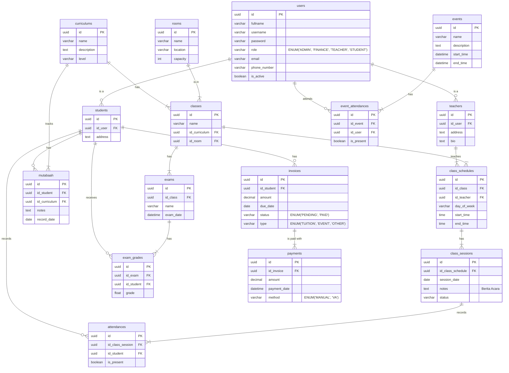

# Skema Database Yayasan Sahabat Quran

Berikut adalah rancangan skema database untuk aplikasi manajemen operasional Yayasan Sahabat Quran. Skema ini dibuat berdasarkan daftar fitur yang ada di file `README.md`.

## Entity Relationship Diagram (ERD)

